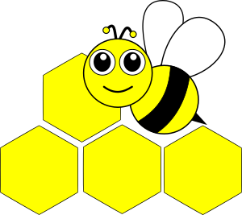

# See Bee


**This is work in progress**

The purpose of this repo is to track, and propagate to event streams,
all changes - updates, insert, and deletes alike - for relational 
database tables in real-time. Supported database platforms will be 
SQL Server (2017 and above) and Postgres (9.6 and above).

**Configuration**

In terms of cluster configuration, the See Bee Docker container needs two things:

1. A link to a SQL Server.
2. A mount of a working directory where Parquet files will be spooled.

To configure See Bee itself, [a YAML file](applications/sql-server-parquet-application/default-config.yaml)
is included in the container at build 
time. At run time, all configuration options may be overridden by command line
parameters sent to the docker instance.

For example, a build time YAML configutaion file may look as follows,

```yaml
system:
  loggingLevel: FINE

parquet:
  workDirectory: /parquet
  spoolDirectory: /parquet/spool
  dictionaryEncodingEnabled: true
  compressionCodec: GZIP

sqlserver-reactor:
  jdbcHostName: sqlserver
  jdbcPort: 1433
  jdbcDatabasename: speedment
  jdbcUsername: sa
  jdbcPassword: Password1
  changesPollIntervalMillis: 1000
  schemaReloadIntervalMillis: 60000
```

but when running the container some values may be altered by command line 
parameters:

```commandline
> docker run --link sqlserver:sqlserver -ti -v /tmp/parquet:/parquet \
   namely/seebee:0.0.2-SNAPSHOT \
   --parquet.compressionCodec=SNAPPY \
   --system.loggingLevel=WARNING
```

**Demo**

For a basic demo of end-to-end communication, try out the following script:

```commandline
> ./demo.sh
```

This script will create three containers in total, showcasing See Bee tracking changes in 
the SQL Server container and creating Parquet files which are being watched by a Spark container.
 
Having the three containers running, updating the SWITCHES table of the SQL Server 
container (using a connection to port 1433) will yield printouts in the running Spark 
container logs.



Bee's eyes contains about 6,900 facets and are well suited for detecting movement.
Some honeybees can perceive movements that are separated by 1/300th of a second
(humans can only sense movements separated by 1/50th of a second).